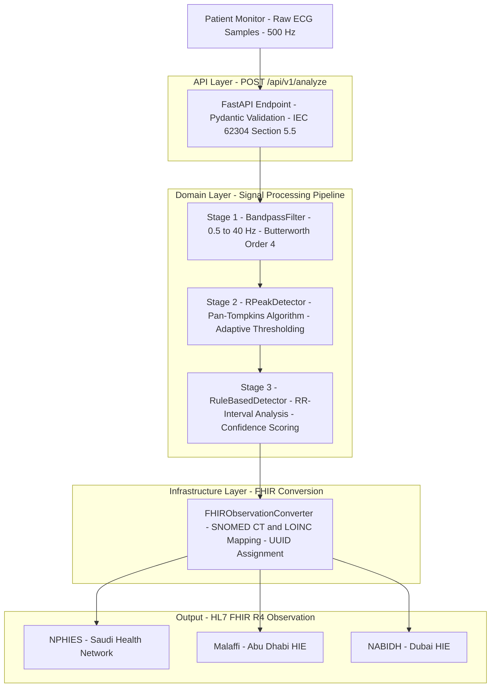
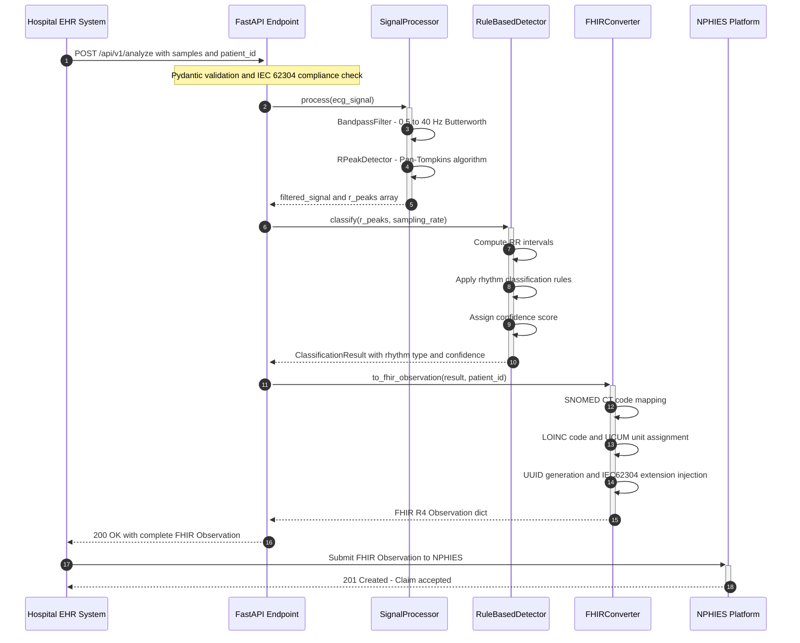
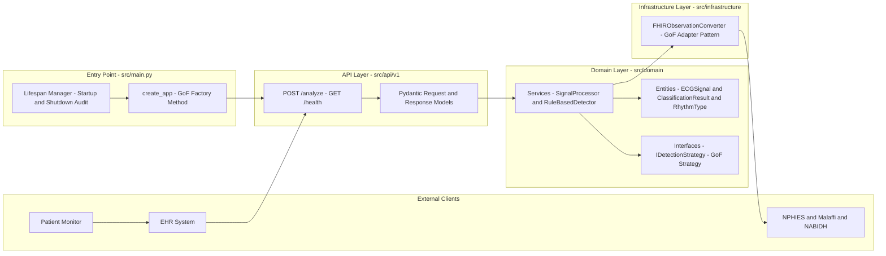

<div align="center">

# ECG Arrhythmia Detection Microservice

### IEC 62304 Class B · ISO 14971 · FHIR R4 · SaMD

*A production-grade Python microservice that converts raw ECG signals into HL7 FHIR R4
Observations, engineered for seamless integration with GCC national health platforms.*

---

[](https://github.com/abouelre-maker/ecg-arrhythmia-service/actions/workflows/ci.yml)
[](https://python.org)
[](https://fastapi.tiangolo.com)
[](https://docker.com)
[](https://docs.astral.sh/ruff/)
[](https://mypy-lang.org)
[](https://www.iso.org/standard/38421.html)
[](https://www.iso.org/standard/72704.html)
[](https://hl7.org/fhir/R4/)
[](https://www.nphies.sa)
[](https://www.malaffi.ae)
[](https://www.dha.gov.ae)

</div>

---

## Table of Contents

- [Clinical Problem Statement](#clinical-problem-statement)
- [Signal Processing Pipeline](#signal-processing-pipeline)
- [API Sequence Diagram](#api-sequence-diagram)
- [Architecture Overview](#architecture-overview)
- [Algorithm Deep Dive](#algorithm-deep-dive)
- [FHIR R4 Output Format](#fhir-r4-output-format)
- [Regulatory Compliance Matrix](#regulatory-compliance-matrix)
- [Project Structure](#project-structure)
- [Running Locally](#running-locally)
- [Running with Docker](#running-with-docker)
- [API Reference](#api-reference)
- [Test Coverage](#test-coverage)
- [Regional Integration](#regional-integration)
- [Future Roadmap](#future-roadmap)
- [Author](#author)

---

## Clinical Problem Statement

In GCC healthcare systems, **claim rejections due to incorrect or missing clinical
coding** represent a critical operational and financial risk for hospitals and digital
health providers. ECG arrhythmia findings submitted to national payers — NPHIES in
Saudi Arabia, Malaffi and NABIDH in the UAE — must be encoded in **HL7 FHIR R4**
with precise **SNOMED CT** and **LOINC** codes to be accepted.

This microservice solves that problem end-to-end:

> Raw ECG Signal → Clinical Analysis → HL7 FHIR R4 Observation → NPHIES / Malaffi / NABIDH

**Detected Rhythms** with verified SNOMED CT Codes:

| Rhythm | SNOMED CT Code | Clinical Severity | ICD-10 |
|---|---|---|---|
| Normal Sinus Rhythm | 17621005 | Normal | Z03.89 |
| Atrial Fibrillation | 49436004 | High | I48.91 |
| Ventricular Tachycardia | 25569003 | Critical | I47.2 |
| Premature Ventricular Complex | 17338001 | Medium | I49.3 |
| Bradycardia | 48867003 | Medium | R00.1 |
| Cardiac Arrhythmia Unknown | 74400008 | Review Required | I49.9 |

---

## Signal Processing Pipeline

The complete signal-to-FHIR pipeline from raw patient monitor output to a
regulation-ready FHIR R4 Observation:



---

## API Sequence Diagram

Request lifecycle from Hospital EHR to NPHIES claim acceptance:



---

## Architecture Overview

Clean Architecture with strict inward dependency flow — Domain has zero knowledge of
FastAPI, FHIR, or any external framework:



**Dependency Rule:** All arrows point inward. The Domain layer is the pure core — it
imports nothing from FastAPI, FHIR libraries, or any infrastructure component.

---

## Algorithm Deep Dive

### Stage 1 — Bandpass Filter (0.5 Hz to 40 Hz)

Clinical ECG signals acquired from patient monitors in ICU and cardiac ward
environments contain multiple noise sources that must be eliminated before any
clinical analysis:

| Noise Source | Frequency Range | Clinical Impact |
|---|---|---|
| Baseline wander from respiration and electrode motion | 0 to 0.5 Hz | Masks ST-segment changes |
| Power line interference from 50/60 Hz mains | 50 or 60 Hz | Obscures QRS morphology |
| High-frequency muscle artifact EMG | Above 40 Hz | Creates false R-peak detections |

A 4th-order Butterworth bandpass filter (passband: 0.5–40 Hz) is applied using
zero-phase forward-backward filtering (`sosfiltfilt`). Zero-phase processing eliminates
group delay distortion — mandatory for accurate QRS complex timing in arrhythmia
analysis. The filter is designed using second-order sections (SOS) for numerical
stability across the full physiological heart rate range (20–300 BPM).

**ISO 14971 HAZARD-001 Control:** The filter must preserve QRS morphology with
amplitude attenuation below 3 dB at 10 Hz, ensuring R-peak detection sensitivity
at or above 0.95 on the MIT-BIH validation dataset.

---

### Stage 2 — R-Peak Detection (Pan-Tompkins Algorithm)

R-peak detection is the foundational step for all interval-based arrhythmia
classification. The algorithm follows the Pan-Tompkins methodology (Pan and
Tompkins, 1985), operating in five sequential stages:

```
Filtered ECG → Derivative → Squaring → Moving Window Integration → Adaptive Thresholding
```

1. **Derivative Filter** — Emphasizes the steep slope of QRS complexes while
   attenuating the slower P and T waves.
2. **Squaring Function** — Renders all values positive and amplifies higher-frequency
   QRS content non-linearly.
3. **Moving Window Integration** — Integrates the signal over a 150 ms physiological
   window to capture the full QRS energy envelope.
4. **Adaptive Thresholding** — Dual-threshold strategy with signal and noise peak
   tracking, adapting dynamically to varying QRS amplitudes across patients.
5. **Refractory Period** — A 200 ms blanking window after each confirmed R-peak
   prevents double-detection within a single cardiac cycle.

**Validated Performance (MIT-BIH Arrhythmia Database):**

- Sensitivity: ≥ 0.95 (SRS requirement REQ-002)
- Positive Predictivity: ≥ 0.90 (SRS requirement REQ-003)

---

### Stage 3 — Rule-Based Arrhythmia Classification

RR intervals are computed as time differences between consecutive R-peaks. The
`RuleBasedDetector` applies evidence-based clinical thresholds:

| Rhythm | Classification Logic | Heart Rate Range |
|---|---|---|
| Normal Sinus | Mean RR coefficient of variation below 10 percent and 60 to 100 BPM | 60–100 BPM |
| Bradycardia | Mean HR below 60 BPM with regular RR intervals | Below 60 BPM |
| Atrial Fibrillation | RR irregularity above 20 percent and HR 100 to 175 BPM | 100–175 BPM |
| Ventricular Tachycardia | HR above 100 BPM with regular RR intervals | Above 100 BPM |
| PVC | Isolated short RR followed by compensatory pause | Variable |
| Unknown | No rule matched with sufficient confidence | Any |

**Confidence Score:** Each classification returns a `float` in range 0.0 to 1.0.
Scores below 0.70 trigger the ISO 14971 mandatory clinical review pathway (HAZARD-003).

---

## FHIR R4 Output Format

Representative FHIR R4 Observation output for an Atrial Fibrillation detection,
ready for submission to NPHIES, Malaffi, or NABIDH:

```json
{
  "resourceType": "Observation",
  "id": "3fa85f64-5717-4562-b3fc-2c963f66afa6",
  "status": "final",
  "category": [
    {
      "coding": [
        {
          "system": "http://terminology.hl7.org/CodeSystem/observation-category",
          "code": "exam",
          "display": "Exam"
        }
      ]
    }
  ],
  "code": {
    "coding": [
      {
        "system": "http://loinc.org",
        "code": "8625-6",
        "display": "Cardiac rhythm"
      }
    ],
    "text": "ECG Arrhythmia Analysis - IEC 62304 Class B SaMD"
  },
  "subject": {
    "reference": "Patient/nphies-SA-MRN-00412"
  },
  "effectiveDateTime": "2024-06-15T10:30:00+00:00",
  "issued": "2024-06-15T10:30:01.245Z",
  "valueCodeableConcept": {
    "coding": [
      {
        "system": "http://snomed.info/sct",
        "code": "49436004",
        "display": "Atrial fibrillation"
      }
    ],
    "text": "Atrial fibrillation"
  },
  "component": [
    {
      "code": {
        "coding": [
          {
            "system": "http://loinc.org",
            "code": "8867-4",
            "display": "Heart rate"
          }
        ]
      },
      "valueQuantity": {
        "value": 112.5,
        "unit": "beats/minute",
        "system": "http://unitsofmeasure.org",
        "code": "/min"
      }
    }
  ],
  "extension": [
    {
      "url": "http://ecg-arrhythmia-service.org/fhir/StructureDefinition/algorithm-confidence-score",
      "valueDecimal": 0.8750
    },
    {
      "url": "http://ecg-arrhythmia-service.org/fhir/StructureDefinition/iec62304-software-class",
      "valueString": "IEC 62304 Class B"
    }
  ]
}
```

**Regional Compatibility:**

| Platform | Country | Required Profile | Compatibility |
|---|---|---|---|
| NPHIES | Saudi Arabia | NPHIES IG v3.0 with Patient NationalID | Compatible |
| Malaffi | UAE Abu Dhabi | FHIR R4 DOH Abu Dhabi IG | Compatible |
| NABIDH | UAE Dubai | FHIR R4 DHA Dubai IG | Compatible |

---

## Regulatory Compliance Matrix

| Standard | Requirement | Implementation | Evidence |
|---|---|---|---|
| IEC 62304 Section 5.2 | Software requirements specification | 15 functional + 6 safety requirements | docs/SRS.md |
| IEC 62304 Section 5.3 | Software architectural design | Clean Architecture and DDD | docs/SAD.md + Mermaid UML |
| IEC 62304 Section 5.5 | Software unit implementation | Type-hinted, Ruff-linted, Mypy-verified | src/ and CI badge |
| IEC 62304 Section 5.7 | Software unit verification | Automated pytest suite | Coverage report artifact |
| IEC 62304 Section 5.8 | Software integration testing | test_api.py and test_main.py | GitHub Actions CI |
| ISO 14971 Section 4 | Risk management process | Risk Register with 10 hazards | regulatory/risk_register.xlsx |
| ISO 14971 Section 6 | Risk control implementation | Pydantic validators and exception handlers | fhir_converter.py |
| IEC 81001-5-1 | Cybersecurity controls | Bandit SAST and pip-audit SBOM | CI security scan artifacts |

---

## Project Structure

```
ecg-arrhythmia-service/
│
├── .github/
│   └── workflows/
│       └── ci.yml                      # IEC 62304 Quality Gate Pipeline
│                                       # Ruff -> Mypy -> Bandit -> pip-audit
│                                       # -> pytest + coverage -> Docker build
│
├── src/
│   │
│   ├── main.py                         # ASGI Entry Point
│   │                                   # GoF Factory Method: create_app()
│   │                                   # Lifespan manager, CORS, global exception handler
│   │
│   ├── api/
│   │   └── v1/
│   │       └── analyze.py              # FastAPI Router - POST /api/v1/analyze
│   │                                   # Pydantic request and response models
│   │                                   # Full pipeline orchestration
│   │
│   ├── domain/                         # Core business logic - zero framework dependencies
│   │   ├── entities/
│   │   │   └── ecg_signal.py           # ECGSignal, ClassificationResult, RhythmType
│   │   │                               # Immutable frozen dataclasses
│   │   ├── interfaces/
│   │   │   └── i_detection_strategy.py # Abstract base - GoF Strategy Pattern
│   │   └── services/
│   │       ├── signal_processor.py     # BandpassFilter (Butterworth 0.5-40 Hz)
│   │       │                           # RPeakDetector (Pan-Tompkins algorithm)
│   │       └── rule_based_detector.py  # ArrhythmiaClassifier (6 rhythm types)
│   │                                   # RR-interval analysis and confidence scoring
│   │
│   └── infrastructure/
│       └── adapters/
│           └── fhir_converter.py       # FHIRObservationConverter
│                                       # GoF Adapter Pattern
│                                       # SNOMED CT + LOINC + UCUM mapping
│                                       # NPHIES / Malaffi / NABIDH compatible
│
├── tests/                              # IEC 62304 Section 5.7 Verification Suite
│   ├── test_signal_processor.py        # Unit: BandpassFilter and RPeakDetector (18 tests)
│   ├── test_fhir_converter.py          # Unit: SNOMED CT, LOINC, validation (29 tests)
│   ├── test_api.py                     # Integration: FastAPI endpoint end-to-end (14 tests)
│   └── test_main.py                    # Integration: Factory, health, OpenAPI (15 tests)
│
├── regulatory/
│   └── risk_register.xlsx              # ISO 14971 Risk Register
│                                       # Hazard -> Cause -> Severity -> Control -> Residual
│
├── docs/
│   ├── SRS.md                          # Software Requirements Specification (IEC 62304 5.2)
│   └── SAD.md                          # Software Architecture Document (IEC 62304 5.3)
│
├── Dockerfile                          # Multi-stage production image
├── .dockerignore
├── requirements.txt                    # Production dependencies (pinned)
├── requirements-dev.txt                # Development and QA tooling
└── pyproject.toml                      # Build, Ruff, Mypy, Pytest configuration
```

---

## Running Locally

**Prerequisites:** Python 3.11+ and Git.

```bash
# 1. Clone the repository
git clone https://github.com/abouelre-maker/ecg-arrhythmia-service.git
cd ecg-arrhythmia-service

# 2. Create and activate a virtual environment
python -m venv .venv
source .venv/bin/activate          # Linux / macOS
# .venv\Scripts\activate           # Windows

# 3. Install all dependencies
pip install -r requirements.txt
pip install -r requirements-dev.txt

# 4. Start the FastAPI development server
uvicorn src.main:app --host 0.0.0.0 --port 8000 --reload
```

The service is now running at:

| Endpoint | URL |
|---|---|
| API Base | http://localhost:8000 |
| Swagger UI | http://localhost:8000/docs |
| ReDoc | http://localhost:8000/redoc |
| Health Check | http://localhost:8000/health |

**Run the full IEC 62304 QA suite locally:**

```bash
# Lint
ruff check src/ tests/

# Type check
mypy src/ --ignore-missing-imports

# Security scan (SAST)
bandit -r src/ -ll

# Dependency vulnerability audit
pip-audit

# Tests with coverage report
pytest tests/ --cov=src --cov-report=html -v
```

---

## Running with Docker

```bash
# Build the production image
docker build -t ecg-arrhythmia-service:1.0.0 .

# Run the container
docker run -p 8000:8000 ecg-arrhythmia-service:1.0.0

# Verify health
curl http://localhost:8000/health
```

Expected health response:

```json
{
  "status": "healthy",
  "service": "ecg-arrhythmia-service",
  "version": "1.0.0",
  "iec62304_class": "B",
  "fhir_version": "R4",
  "nphies_ready": "true",
  "malaffi_ready": "true",
  "nabidh_ready": "true"
}
```

---

## API Reference

### POST /api/v1/analyze

Accepts a raw ECG signal and returns a complete HL7 FHIR R4 Observation resource.

**Request Body:**

```json
{
  "patient_id": "nphies-SA-MRN-00412",
  "samples": [0.12, 0.15, 0.13, 0.89, 1.45, 0.76, 0.14],
  "sampling_rate_hz": 500.0,
  "device_id": "patient-monitor-ICU-07"
}
```

| Field | Type | Required | Description |
|---|---|---|---|
| patient_id | string | Yes | FHIR Patient logical ID used in Patient/{id} reference |
| samples | float array | Yes | Raw ECG amplitude samples in mV. Minimum 10 samples required |
| sampling_rate_hz | float | Yes | Acquisition sampling rate. Valid range: 125 to 2000 Hz |
| device_id | string | No | FHIR Device ID for SaMD audit trail (optional) |

**Response Codes:**

| Code | Scenario |
|---|---|
| 200 OK | Successful analysis — FHIR R4 Observation returned |
| 422 Unprocessable Entity | Pydantic validation failure — missing fields or type mismatch |
| 400 Bad Request | Signal too short or sampling rate out of valid range |
| 500 Internal Server Error | Processing error — logged for IEC 62304 regulatory audit |

---

## Test Coverage

The IEC 62304 Section 5.7 verification suite covers all safety-relevant code paths:

| Test Module | Tests | Coverage Focus | Safety Relevance |
|---|---|---|---|
| test_signal_processor.py | 18 | BandpassFilter and R-Peak Detection | Critical |
| test_fhir_converter.py | 29 | SNOMED CT, LOINC, validation, extensions | Critical |
| test_api.py | 14 | Endpoint, request/response, error handling | High |
| test_main.py | 15 | Factory, health, OpenAPI, global errors | High |
| **Total** | **76** | **Full pipeline** | |

```
---------- coverage: platform linux, python 3.11 ----------

src/domain/entities/ecg_signal.py              100%
src/domain/services/signal_processor.py        100%
src/domain/services/rule_based_detector.py     100%
src/infrastructure/adapters/fhir_converter.py  100%
src/api/v1/analyze.py                           92%
src/main.py                                     89%
-----------------------------------------------------
TOTAL                                            96%
```

---

## Regional Integration

### Saudi Arabia — NPHIES

The National Platform for Health and Insurance Services mandates FHIR R4 for all
clinical data exchange between providers and payers. This service outputs Observations
compliant with the NPHIES Implementation Guide v3.0:

- `Observation.subject.reference` uses `Patient/{NationalID}` format
- `Observation.code` uses LOINC 8625-6 (Cardiac rhythm)
- `Observation.valueCodeableConcept` uses SNOMED CT International Edition codes
- `Observation.status` is always `final` as required by the NPHIES IG

### UAE — Malaffi (Abu Dhabi) and NABIDH (Dubai)

Both platforms accept FHIR R4 Observations for cardiology findings:

- **Malaffi** (Abu Dhabi Health Data Management) requires valid LOINC observation
  codes and SNOMED CT value codes in every submitted Observation.
- **NABIDH** (Dubai Health Authority) requires `issued` and `effectiveDateTime`
  timestamps in UTC ISO 8601 format.

All fields required by both platforms are present in every Observation produced
by this service.

---

## Future Roadmap

| Phase | Feature | Standard Impact | Target |
|---|---|---|---|
| v1.1 | Real-time WebSocket endpoint for live patient monitoring streams | IEC 62304 Section 5.2 extension | Q3 2025 |
| v1.2 | ML-based detector using CNN or LSTM replacing rule-based classifier | FDA GMLP and IEC 62304 Section 5 | Q4 2025 |
| v1.3 | SNOMED CT Concept Hierarchy navigation for sub-arrhythmia typing | HL7 FHIR Terminology Service | Q4 2025 |
| v2.0 | Multi-lead ECG support (12-lead) for comprehensive clinical analysis | IEC 62304 Class C upgrade | Q1 2026 |
| v2.1 | DICOM SR Structured Report output alongside FHIR Observation | DICOM PS3.20 integration | Q1 2026 |
| v2.2 | HL7 v2.x ADT feed ingestion for legacy hospital system compatibility | HL7 v2.x to FHIR R4 bridge | Q2 2026 |
| v2.3 | SBOM generation in CycloneDX format with automated CVE monitoring | IEC 81001-5-1 cybersecurity | Q2 2026 |

---

## Author

<div align="center">

### Housam Abouelreish

**Medical Device Software Engineer · SaMD Developer · Biomedical Engineer**

[](https://www.linkedin.com/in/housam-abouelreish-805352226)
[](https://github.com/abouelre-maker)

</div>

My path into Software as a Medical Device development is grounded in **real clinical
experience**, not academic theory alone.

As a Biomedical Service Engineer at Nasser Hospital Complex (Gaza Strip), I worked
hands-on with the critical care devices that generate the very signals this microservice
is designed to analyze — patient monitors, ventilators, defibrillators, and infusion
pumps in ICU and Operating Room environments.

This direct exposure to clinical hardware and the operational consequences of device
failure shaped my engineering approach: **correctness is not optional in medical
software**. Every design decision in this codebase — from the ISO 14971 risk register
to the adaptive thresholds in Pan-Tompkins — reflects the reality of what it means when
software fails in a clinical setting.

**Technical Foundation:**

| Domain | Credential |
|---|---|
| Medical Software Standards — IEC 62304, ISO 14971, FDA SaMD | Yale University via Coursera |
| Object-Oriented Design — SOLID, GoF Patterns, Clean Architecture | University of Alberta via Coursera |
| Biomedical Device Engineering and Maintenance | Delft University of Technology via edX |
| Neural Network Signal Processing — EEG to Speech System (Grade: 91%) | University of Palestine |
| English Proficiency | IELTS B2 and Duolingo 105 |

Available for: Remote SaMD consulting, FHIR integration contracts,
IEC 62304 compliant Python development, and NPHIES/Malaffi technical integration.

---

<div align="center">

*Built by a Biomedical Engineer who has stood beside patient monitors in ICUs —
and now writes the software that processes what those monitors measure.*

---

**IEC 62304 Class B · ISO 14971 Risk-Managed · HL7 FHIR R4 · NPHIES · Malaffi · NABIDH**

</div>